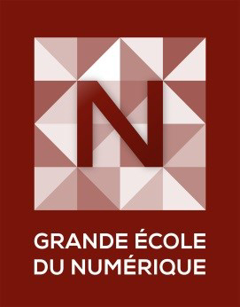

###**LabFab School Mobility**  
 Une formation de la grande école du numérique 

{: .text-purple}

  <i class="fa fa-circle fa-stack-2x text-white"></i>
  <i class="fa fa-tablet fa-stack-1x text-orange"></i>

# Une formation **diplômante** de niveau BAC+1 à l'Université de Rennes 1 adossée au [fablab de Beaulieu](http://fablab.istic.univ-rennes1.fr/) pour découvrir et approfondir la compréhension des outils des **makers** tout en apprenant les bases du **développement d'applications mobiles**. Une formation à destination des jeunes, des personnes sans diplôme ou à la recherche d'un emploi .  
{: .text-purple}

  

