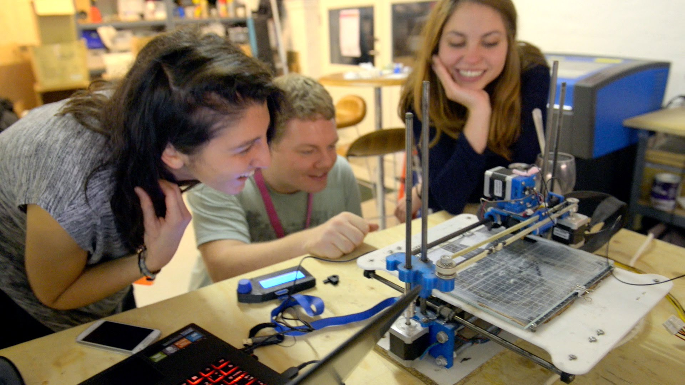

## Une formation à destination des makers

Une formation pour 15 étudiants avec un critère de sélection prioritaire **la motivation**.

Une attention particulièrement sera donnée aux candidatures :

- de jeunes éloignés de l'emploi et /ou du Numérique,
- des femmes,
- des personnes en situation de handicap.
- des étudiants L1 en situation de décrochage.

Le baccalauréat n'est pas requis pour faire acte de candidature.

#
