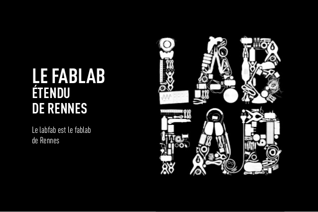

La formation se déroulera sur Rennes sur le [campus de Beaulieu](https://goo.gl/maps/2RzZzaMcVhz) de l'[Université de Rennes 1](https://www.univ-rennes1.fr/).

<iframe src="https://www.google.com/maps/embed?pb=!1m18!1m12!1m3!1d2663.73053823936!2d-1.6409106865178071!3d48.1154335792216!2m3!1f0!2f0!3f0!3m2!1i1024!2i768!4f13.1!3m3!1m2!1s0x480edee4490f4333%3A0x3c4238e97734ee99!2sISTIC!5e0!3m2!1sfr!2sfr!4v1459425562960" width="600" height="450" frameborder="0" style="border:0" allowfullscreen></iframe>

## Un contexte rennais très favorable

Pour accompagner cette mutation, L’agglomération de Rennes et l’Université de Rennes disposent de nombreux atouts :

- une cité étudiante dans laquelle sont présentes deux grandes universités et de nombreuses écoles d’ingénieur.
- l'existence de nombreuses associations dans le domaine DIY.
- l’Université des TICE, futur centre de formation et de valorisation de l’enseignement porté par la COMUE UBL et localisé au rez-de-chaussée du Pôle Numérique Rennes Beaulieu sur le campus de Beaulieu. Ce centre, qui ouvrira ses portes en avril 2016, proposera une offre de formation, des séminaires et journées d’étude en pédagogie universitaire numérique ; il animera un ensemble d’activités liant la communauté universitaire, les collectivités et les entreprises et portant sur l’enjeu de la rénovation pédagogique. 2 espaces d’expérimentation seront mis à la disposition des enseignants : un learning lab ou classe prototype pour expérimenter des outils et équipements développés par des
laboratoires de recherche ou des entreprises et un teaching lab ou fablab dédié aux apprentissages, pour fabriquer des objets d’apprentissage dans le cadre de projets pédagogiques. L’UTICE mettra donc en relation les créateurs, les enseignants et leurs étudiants pour monter ces projets.

##
